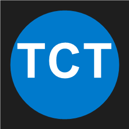

# TCT Git Auto-Commiter for VS Code

🚀 **Advanced Git auto-commit automation with AI-powered commit messages**

Transform your development workflow with intelligent, automated Git commits directly in VS Code!



## ✨ Features

- **🤖 AI-Powered Commit Messages** - Generate intelligent commit messages using Gemini, OpenAI, Claude, or Ollama
- **⚡ Auto-Commit Engine** - Automatically detect changes and commit at configurable intervals
- **🎯 Smart Branch Management** - Automatically switch to dedicated auto-commit branches
- **📊 Real-Time Dashboard** - Monitor commits, errors, uptime, and memory usage
- **🔄 Error Recovery** - Automatic retry mechanism with configurable max attempts
- **🔔 Webhook Notifications** - Send updates to Discord, Slack, or custom webhooks
- **↶ One-Click Rollback** - Easily undo the last commit
- **🌳 Tree View Interface** - Beautiful sidebar with dashboard, controls, and logs
- **💻 Terminal Logs** - Hacker-style green-on-black terminal for all activities
- **🎨 Modern UI** - VS Code-native design with smooth transitions

## 📦 Installation

### From VSIX (Local Install)

1. Download `tct-git-automation-5.0.0.vsix`
2. In VS Code: `Extensions` → `...` → `Install from VSIX`
3. Select the downloaded file

### From Source

```bash
cd tct-vscode-extension
npm install
npm run compile
# Press F5 to launch extension development host
```

## 🚀 Quick Start

1. **Open a Git repository** in VS Code
2. **Click the TCT icon** in the Activity Bar (left sidebar)
3. **Configure your AI provider** in Settings
4. **Click "▶ Start Auto-Commit"** in the Controls panel

That's it! TCT will now automatically commit your changes.

## ⚙️ Configuration

Open VS Code Settings (`Ctrl+,`) and search for "TCT":

### Basic Settings

| Setting                     | Default     | Description                          |
| --------------------------- | ----------- | ------------------------------------ |
| `tct.autoBranch`            | `dage/auto` | Branch name for auto-commits         |
| `tct.delaySeconds`          | `60`        | Delay between commit checks          |
| `tct.enableAutoCommit`      | `false`     | Start auto-commit on VS Code startup |
| `tct.enablePushAfterCommit` | `true`      | Automatically push after commit      |

### AI Provider Settings

| Setting            | Options                                        | Description                    |
| ------------------ | ---------------------------------------------- | ------------------------------ |
| `tct.llmProvider`  | `gemini`, `openai`, `claude`, `ollama`, `none` | AI service for commit messages |
| `tct.geminiApiKey` | -                                              | Google Gemini API Key          |
| `tct.openaiApiKey` | -                                              | OpenAI API Key                 |
| `tct.claudeApiKey` | -                                              | Anthropic Claude API Key       |
| `tct.ollamaModel`  | `llama3.2:latest`                              | Ollama model name              |

### Advanced Settings

| Setting                     | Default                                     | Description                   |
| --------------------------- | ------------------------------------------- | ----------------------------- |
| `tct.enableErrorRecovery`   | `true`                                      | Automatic retry on failure    |
| `tct.maxRetries`            | `3`                                         | Maximum retry attempts        |
| `tct.commitMessageTemplate` | `Auto: {message}`                           | Template for commit messages  |
| `tct.excludePatterns`       | `["node_modules", ".git", "dist", "build"]` | Files to exclude              |
| `tct.webhookUrl`            | -                                           | Webhook URL for notifications |
| `tct.enableNotifications`   | `true`                                      | Show desktop notifications    |

## 🎮 Commands

Access these via Command Palette (`Ctrl+Shift+P`):

- `TCT: Start Auto-Commit` - Start the auto-commit engine
- `TCT: Stop Auto-Commit` - Stop auto-commit
- `TCT: Pause Auto-Commit` - Pause/resume auto-commit
- `TCT: Rollback Last Commit` - Undo the last commit
- `TCT: Open Settings` - Open TCT settings
- `TCT: Open Dashboard` - Open full dashboard webview
- `TCT: Export Logs` - Export logs to file
- `TCT: Clear Logs` - Clear all logs
- `TCT: Optimize Memory` - Free up memory
- `TCT: Refresh Dashboard` - Refresh all views

## 📊 Dashboard Metrics

The TCT sidebar shows real-time metrics:

- **💾 Total Commits** - Number of successful commits
- **⚠ Total Errors** - Number of failed attempts
- **⏱ Uptime** - How long the engine has been running
- **📦 Memory Usage** - Current memory consumption
- **🌿 Current Branch** - Active Git branch
- **📝 Last Commit** - Most recent commit message

## 🔧 API Keys Setup

### Get Gemini API Key (Free!)

1. Visit [Google AI Studio](https://makersuite.google.com/app/apikey)
2. Click "Create API Key"
3. Copy the key to `tct.geminiApiKey` setting

### Get OpenAI API Key

1. Visit [OpenAI Platform](https://platform.openai.com/api-keys)
2. Create new secret key
3. Copy to `tct.openaiApiKey` setting

### Get Claude API Key

1. Visit [Anthropic Console](https://console.anthropic.com/)
2. Generate API key
3. Copy to `tct.claudeApiKey` setting

### Use Ollama (Local)

1. Install [Ollama](https://ollama.ai/)
2. Run: `ollama pull llama3.2`
3. Set provider to `ollama`

## 🔔 Webhook Integration

### Discord Webhook

1. Discord Server → Settings → Integrations → Webhooks
2. Create webhook, copy URL
3. Paste into `tct.webhookUrl` setting

### Slack Webhook

1. [Slack Apps](https://api.slack.com/apps) → Create New App
2. Incoming Webhooks → Add New Webhook
3. Copy URL to `tct.webhookUrl` setting

## 💡 Use Cases

- **Continuous Backup** - Never lose work with automatic commits
- **WIP Tracking** - Track work-in-progress automatically
- **Client Demos** - Show real-time progress updates
- **Learning** - Keep history of all your coding experiments
- **Solo Projects** - Focus on coding, not commit messages
- **Pair Programming** - Auto-document collaboration sessions

## 🎨 UI Components

### Sidebar Panels

1. **Dashboard** - Real-time metrics and statistics
2. **Controls** - Buttons for all actions (start, stop, rollback, etc.)
3. **Terminal Logs** - Hacker-style green logs with timestamps

### Status Bar

Bottom-left shows current status:

- `$(play-circle) TCT: Running` - Active
- `$(debug-pause) TCT: Paused` - Paused
- `$(circle-outline) TCT: Stopped` - Inactive

## 🐛 Troubleshooting

### Extension not starting?

- Check Output panel: `View` → `Output` → `TCT Git Automation`
- Ensure workspace has a Git repository
- Verify VS Code version >= 1.80.0

### AI not generating messages?

- Check API key is correctly configured
- Verify internet connection
- Check provider status (Gemini, OpenAI, etc.)
- Try `none` provider for simple messages

### Commits not pushing?

- Check Git credentials are configured
- Verify remote repository access
- Enable `git.autofetch` in VS Code settings

### High memory usage?

- Click "⚡ Optimize" in Controls panel
- Reduce `tct.delaySeconds` for less frequent checks
- Clear logs regularly with "🗑 Clear Logs"

## 📝 Changelog

### v5.0.0 (2025-11-25)

- ✨ Initial VS Code extension release
- 🎨 Modern sidebar with dashboard, controls, and logs
- 🤖 AI-powered commit messages (4 providers)
- 🔄 Automatic error recovery and retry
- 🔔 Webhook notifications (Discord, Slack)
- ↶ One-click rollback feature
- 📊 Real-time metrics dashboard
- 💻 Hacker-style terminal logs
- ⚙️ Comprehensive configuration options

## 🤝 Contributing

Contributions welcome! Please visit our [GitHub repository](https://github.com/mdhossain-2437/delowar-portfolio).

## 📄 License

MIT License - feel free to use in your projects!

## 🙏 Acknowledgments

- Inspired by the original TCT PowerShell script
- Built with love for the developer community
- Powered by AI (Gemini, OpenAI, Claude, Ollama)

## 📧 Support

- 🐛 [Report Issues](https://github.com/mdhossain-2437/delowar-portfolio/issues)
- 💬 [Discussions](https://github.com/mdhossain-2437/delowar-portfolio/discussions)
- 📧 Email: mdhossain2437@example.com

---

**Made with ❤️ by TCT Studio**

_Transform your Git workflow today!_ 🚀
